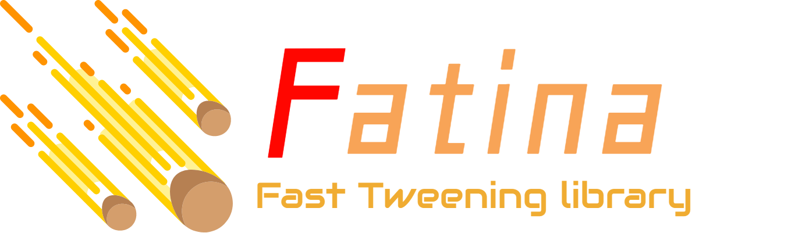

# Fatina Helpers
Small & Light tweening library for **Games** / **Web**

* **Website**: [Here](https://kefniark.github.io/Fatina/)
* **API**: [Here](https://kefniark.github.io/Fatina/api/basic/)
* **Samples**: [Here](https://kefniark.github.io/Fatina/samples/generic/)

[](https://npmjs.org/package/fatina-plugin-helpers)
[](https://npmjs.org/package/fatina-plugin-helpers)
[](https://travis-ci.org/kefniark/Fatina-Plugin-Helpers)
[](https://coveralls.io/github/kefniark/Fatina-Plugin-Helpers?branch=master)
[](https://www.codacy.com/app/kefniark/Fatina-Plugin-Helpers?utm_source=github.com&amp;utm_medium=referral&amp;utm_content=kefniark/Fatina-Plugin-Helpers&amp;utm_campaign=Badge_Grade)
[](https://npmjs.org/package/fatina-plugin-helpers)

## Description
This plugin is just a set of helpers to provide a better integration of Fatina with javascript games library (pixi, phaser, ...)

**This plugin requires Fatina** : [Here](https://github.com/kefniark/Fatina)

## Getting Started

### Install
If you use directly the minified version
```ts
<script src="fatina-plugin-helpers.min.js"></script>
```
Or if you use NPM
```ts
> npm install fatina-plugin-helpers
```

### Init
```ts
// standard node.js require
var FatinaHelpers = require('fatina-plugin-helpers');
// OR
// standard import with typescript (typed version)
import * as FatinaHelpers from 'fatina-plugin-helpers';
```

and initialize (add this plugin to **Fatina**)
```ts
Fatina.Init();
Fatina.LoadPlugin(FatinaHelpers.Get());
```

### Usage
You can now populate any kind of object with the following method (container, sprites, camera, ...)
```ts
Fatina.plugin.AddHelpers(myObject);
```

## Methods
Here are the helpers automatically added:

### Position
Following methods use `.position.x` and `.position.y`

* myObject.**MoveTo(x, y, duration)** : Move to an absolute position
* myObject.**MoveXTo(x, duration)**
* myObject.**MoveYTo(y, duration)**
* myObject.**MoveToRel(x, y, duration)** : Move to a relative position
* myObject.**MoveXToRel(x, duration)**
* myObject.**MoveYToRel(y, duration)**
* myObject.**PunchPosition(x, y, duration, iteration)** : Oscillate around the current position
* myObject.**Shake(x, y, duration, iteration)** : Shake around the current position

### Rotation
Following methods use `.rotation`

* myObject.**RotateTo(angle, duration)** : Rotate to a specific angle in radiant (to PI/2)
* myObject.**RotateToRel(angle, duration)** : Rotate by a relative radiant angle (+PI/2)
* myObject.**RotateDegTo(angle, duration)** : Rotate to a specific angle in degrees (to 90°)
* myObject.**RotateDegToRel(angle, duration)** : Rotate to a specific angle in degrees (+90°)
* myObject.**PunchRotate(angle, duration, iteration)**

### Alpha
Following method use `.alpha`

* myObject.**FadeTo(alpha, duration)** : Alpha is a float between 0 and 1 (1: fadeIn, 0: fadeOut)

### Scale
Following methods use `.scale.x` and `.scale.y`

* myObject.**ScaleTo(x, y, duration)** : Scale to a specified value
* myObject.**ScaleXTo(x, duration)**
* myObject.**ScaleYTo(y, duration)**
* myObject.**ScaleToRel(x, y, duration)**
* myObject.**ScaleXToRel(x, duration)**
* myObject.**ScaleYToRel(y, duration)**
* myObject.**PunchScale(x, y, duration, iteration)**

### Color / Tint
Following methods use `.tint` or `.hue` (the color API are slightly different between libs)

* myObject.**ColorTo(r, g, b, duration)** : R,G,B are float between 0-1
* myObject.**ColorToRel(r, g, b, duration)**
* myObject.**ColorRGBTo(hex, duration)** : hex is a string representation '#FFFFFF'
* myObject.**ColorRGBToRel(hex, duration)**
* myObject.**PunchColor(r, g, b, duration, iteration)**